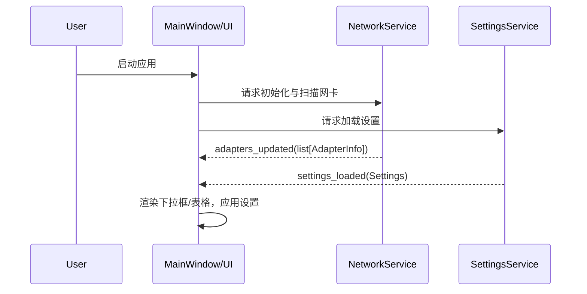
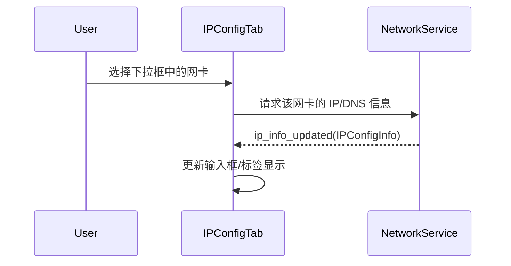
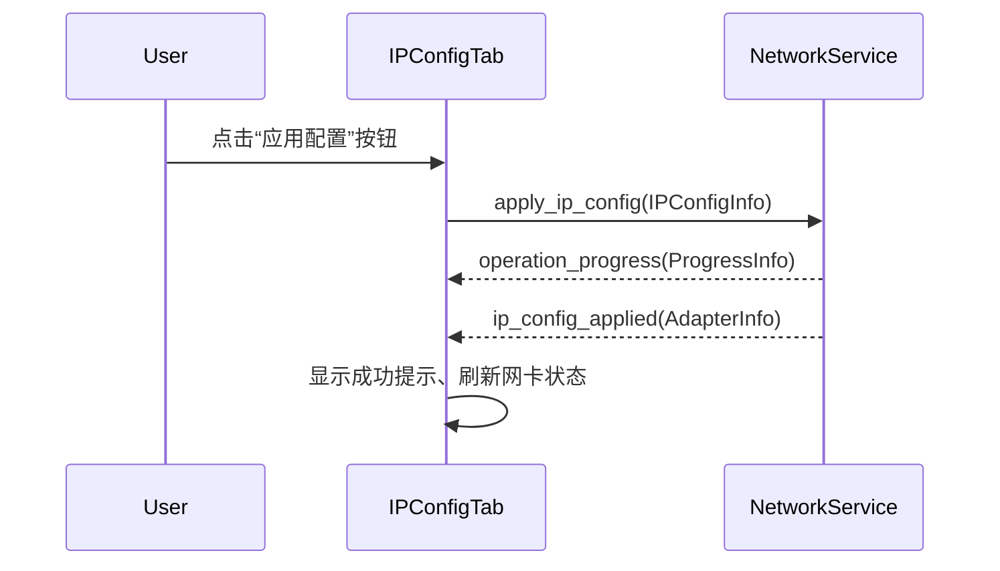
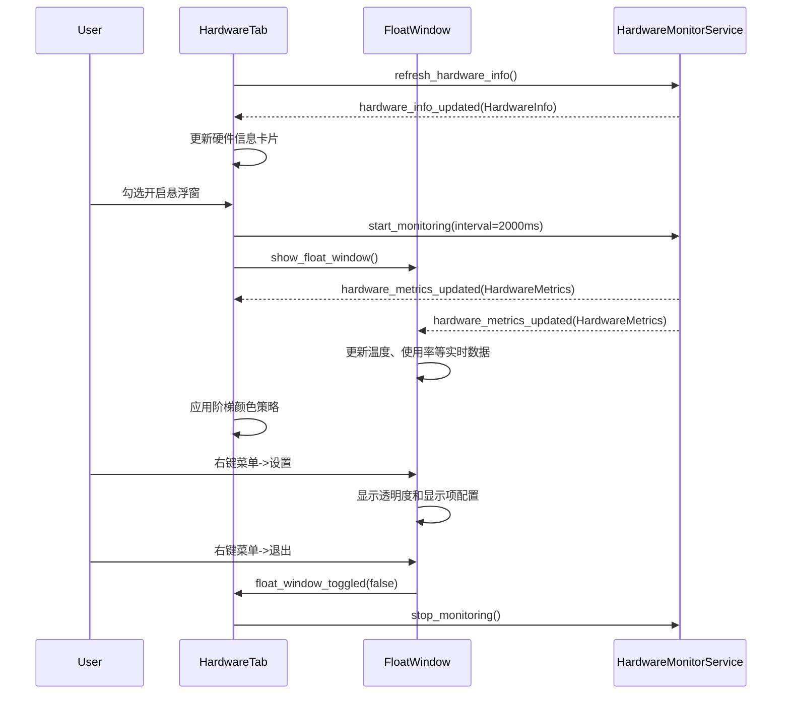
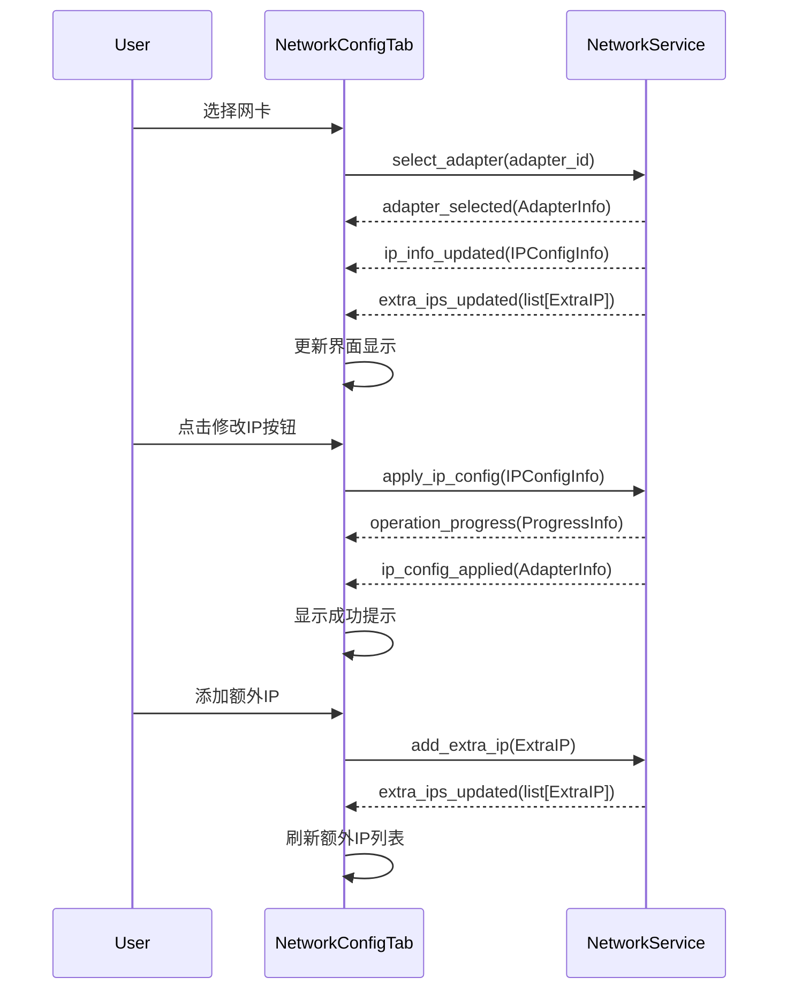
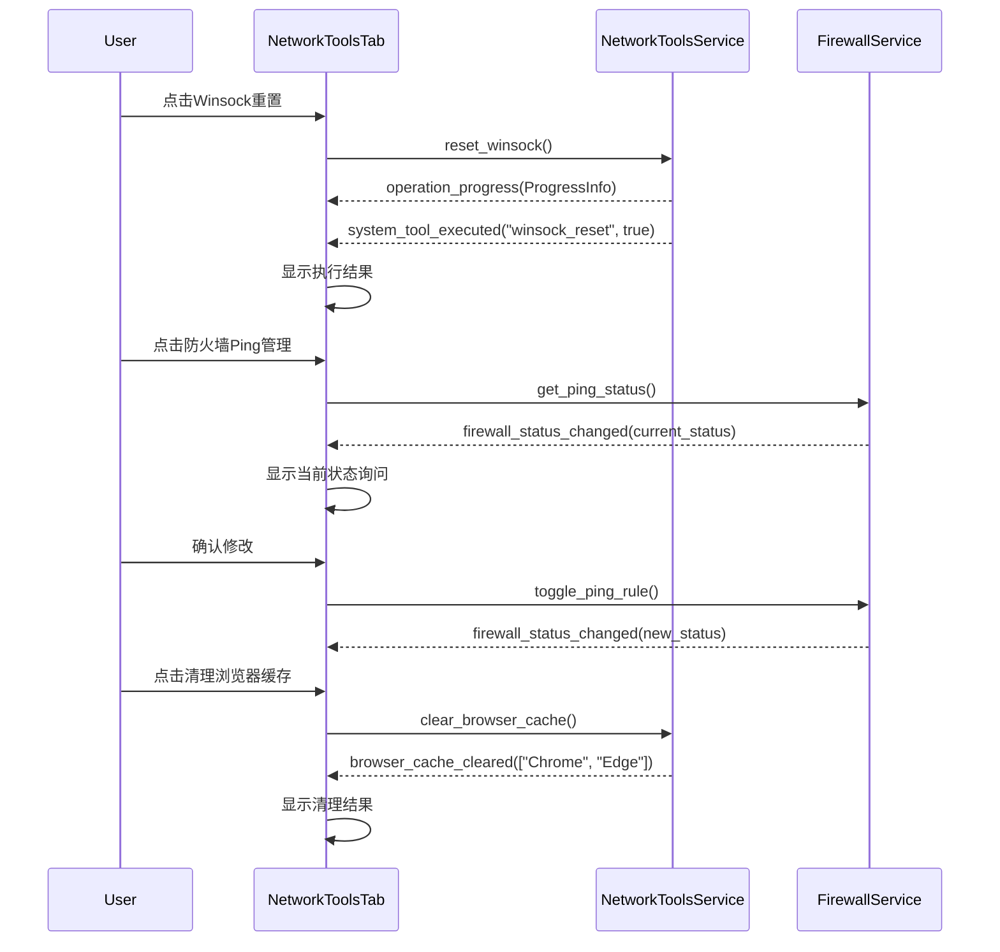
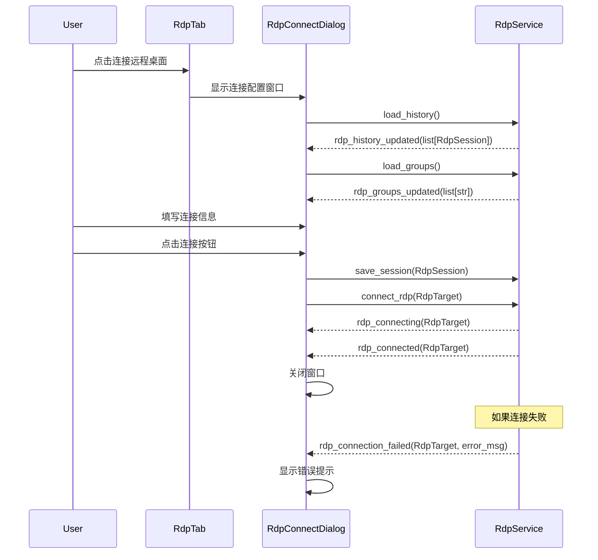

# FlowDesk 数据流与状态管理设计 v2025-08-30

## 1. 架构原则 - 已实现 ✅
- **UI 零业务**：UI层严格遵循零业务逻辑原则，已在NetworkConfigTab中验证
- **信号驱动**：PyQt信号槽机制完全实现，NetworkService已定义8个核心信号
- **明确数据模型**：AdapterInfo/IPConfigInfo/ExtraIP等模型类已完整实现
- **StylesheetService统一管理**：模块化QSS架构已实现，支持8个样式文件
- **分层架构**：Model-Service-UI三层分离已严格执行

## 2. 关键流程序列图

### 2.1 启动应用


### 2.2 选择网卡


### 2.3 应用网络配置


## 3. 核心信号定义表 - 基于当前实现 v2025-08-30

### 3.1 NetworkService已实现信号 ✅
- ✅ `adapters_updated(list[AdapterInfo])` - 网卡列表更新(已实现)
- ✅ `adapter_selected(AdapterInfo)` - 网卡选择变更(已实现)
- ✅ `ip_info_updated(IPConfigInfo)` - IP配置信息更新(已实现)
- ✅ `ip_config_applied(AdapterInfo)` - IP配置应用成功(已实现)
- ✅ `extra_ips_updated(list[ExtraIP])` - 额外IP列表更新(已实现)
- ✅ `network_info_copied(str)` - 网卡信息复制完成(已实现)
- ✅ `operation_progress(ProgressInfo)` - 操作进度反馈(已实现)
- ✅ `error_occurred(ErrorInfo)` - 统一错误处理(已实现)

### 3.2 NetworkToolsService计划信号 🚧
- 🚧 `ping_started(str)` - Ping测试开始(规划中)
- 🚧 `ping_result(PingResult)` - Ping结果更新(规划中)
- 🚧 `tracert_started(str)` - 路由追踪开始(规划中)
- 🚧 `system_tool_executed(str, bool, str)` - 系统工具执行结果(规划中)
- 🚧 `firewall_ping_status(bool)` - 防火墙Ping规则状态(规划中)
- 🚧 `browser_cache_cleared(list[str])` - 浏览器缓存清理完成(规划中)
- 🚧 `winsock_reset_completed(bool)` - Winsock重置完成(规划中)

### 3.3 RdpService计划信号 🚧
- 🚧 `rdp_enabled(bool)` - RDP服务启用状态(规划中)
- 🚧 `rdp_connecting(RdpTarget)` - RDP连接开始(规划中)
- 🚧 `rdp_connected(RdpTarget)` - RDP连接成功(规划中)
- 🚧 `rdp_history_updated(list[RdpSession])` - RDP历史记录更新(规划中)
- 🚧 `rdp_session_saved(RdpSession)` - RDP会话保存完成(规划中)

### 3.4 HardwareMonitorService计划信号 🚧
- 🚧 `hardware_info_updated(HardwareInfo)` - 硬件信息更新(规划中)
- 🚧 `hardware_metrics_updated(HardwareMetrics)` - 实时监控数据更新(规划中)
- 🚧 `float_window_toggled(bool)` - 悬浮窗显示状态(规划中)
- 🚧 `lhm_status_changed(bool)` - LibreHardwareMonitor可用状态(规划中)

### 3.5 SystemTrayService已实现信号 ✅
- ✅ `show_main_window()` - 显示主窗口(已实现)
- ✅ `exit_application()` - 退出应用程序(已实现)
- ✅ `tray_message(str, str)` - 托盘通知消息(已实现)

### 3.6 StylesheetService已实现信号 ✅
- ✅ `styles_loaded()` - 样式表加载完成(已实现)
- ✅ `style_error(str)` - 样式加载错误(已实现)

## 4. UI 槽函数注释示范
```python
# 说明：此槽函数专用于响应 NetworkService 的适配器更新信号。
# 角色：将原始数据列表转换为 UI 模型，并更新下拉框选项。
# 原因：这是驱动主界面网络相关显示的核心入口。
def on_adapters_updated(self, adapters: list[AdapterInfo]) -> None:
    self.adapter_combo.clear()
    for adapter in adapters:
        self.adapter_combo.addItem(adapter.friendly_name, adapter)

## 8. 能力矩阵（运行期）
- 结构：`capabilities = { "win7": bool, "hw_monitor": bool, "admin": bool }`
- 用途：UI 初始化时根据能力禁用不支持的功能，并显示解释性提示。

## 9. 硬件监控与悬浮窗数据流


## 10. 资源与图标
- 图标从 `assets/icons/` 加载；通过统一的 `resource_path()` 定位。
- 托盘与窗口图标保持一致；Win7 无法启用高级效果时维持图标清晰度。

## 11. 数据模型定义 - 当前实现状态 v2025-08-30

### 11.1 网络相关模型 - 已实现 ✅
```python
# 以下模型已在 src/flowdesk/models/adapter_info.py 中完整实现 (245行)
@dataclass
class AdapterInfo:
    # 基本信息
    id: str                        # ✅ 网卡GUID
    name: str                      # ✅ 系统名称  
    friendly_name: str             # ✅ 友好名称
    mac_address: str               # ✅ MAC地址
    status: str                    # ✅ 状态(已连接/已禁用/未连接)
    
    # IP配置信息
    ip_addresses: list[str]        # ✅ 主要IP地址列表
    ipv6_addresses: list[str]      # ✅ IPv6地址列表(v2025-08-30新增)
    subnet_masks: list[str]        # ✅ 子网掩码列表
    gateway: str                   # ✅ 默认网关
    dns_servers: list[str]         # ✅ DNS服务器列表
    dhcp_enabled: bool             # ✅ DHCP启用状态
    
    # 性能信息
    link_speed: str                # ✅ 链路速度
    interface_type: str            # ✅ 接口类型(有线/无线)
    
    # 额外IP管理
    extra_ips: list[ExtraIP]       # ✅ 额外IP列表

@dataclass
class IPConfigInfo:                # ✅ IP配置传输模型
    adapter_id: str
    ip_address: str
    subnet_mask: str
    gateway: str
    dns_primary: str
    dns_secondary: str
    dhcp_enabled: bool

@dataclass 
class ExtraIP:                     # ✅ 额外IP管理模型
    ip_address: str
    subnet_mask: str
    selected: bool = False

@dataclass
class DnsConfig:                   # ✅ DNS配置模型
    primary: str
    secondary: str
```

### 11.2 未来模型计划 🚧
```python
# 以下模型将在各自功能开发时实现
@dataclass
class PingResult:                  # 🚧 网络工具模型(规划中)
    target: str
    response_time: float  
    status: str
    color: str
    timestamp: datetime

@dataclass
class SystemToolResult:            # 🚧 系统工具结果(规划中)
    tool_name: str
    success: bool
    message: str
    details: str = ""
```

### 11.3 远程桌面模型 - 规划中 🚧
```python
# 以下模型将在远程桌面Tab开发时实现
@dataclass 
class RdpSession:                  # 🚧 RDP会话模型(规划中)
    id: str
    target_ip: str
    port: int = 3389
    username: str = "Administrator"
    password: str = ""
    group: str = "全部"
    remark: str = ""
    connection_count: int = 0
    last_connected: datetime = None

@dataclass
class RdpTarget:                   # 🚧 RDP连接目标(规划中)
    ip: str
    port: int
    username: str
    password: str
```

### 11.4 硬件监控模型 - 规划中 🚧
```python
# 以下模型将在硬件监控Tab开发时实现
@dataclass
class HardwareMetrics:             # 🚧 实时硬件指标(规划中)
    cpu_temp: float
    cpu_temp_color: str            # 阶梯颜色策略
    cpu_usage: float
    cpu_usage_color: str
    gpu_temp: float
    gpu_temp_color: str
    memory_usage: float
    memory_usage_color: str
    network_upload: float
    network_download: float
    local_ip: str
    timestamp: datetime

@dataclass
class FloatWindowSettings:         # 🚧 悬浮窗配置(规划中)
    opacity: float = 0.8
    show_cpu_temp: bool = True
    show_cpu_usage: bool = True
    show_gpu_temp: bool = True
    show_ip_address: bool = True
    show_network_speed: bool = True
    position_x: int = -1
    position_y: int = -1

@dataclass
class HardwareInfo:                # 🚧 硬件详细信息(规划中)
    cpu: dict
    gpu: list[dict]
    memory: dict
    storage: list[dict]
    motherboard: dict
    system: dict
```

## 12. 典型流程：网络配置页面交互


## 13. 典型流程：网络工具页面9宫格按钮


## 14. 典型流程：远程桌面连接管理


## 15. 角色与职责（硬约束）
- UI（View）：仅连接与更新视图；不包含任何业务逻辑、系统命令、数据解析。
- Service：执行业务与系统访问；统一发射模型化信号；处理错误并给出 ErrorInfo.

## 16. 线程与进度
- 长任务（扫描、写入、tracert、LHM 采样）在服务层线程/线程池运行；
- 进度通过 `operation_progress(ProgressStep)` 分段回传到 UI 主线程；
- UI 槽函数只更新视图，不阻塞。

## 17. 验收断言
- UI 层无任何 `subprocess/wmi/winreg` 等调用；
- 所有 `emit` 负载均为模型类实例或只读基本类型；
- 停止/完成事件完整闭环：started → progress → completed/stopped；
- 错误统一走 `error_occurred(ErrorInfo)` 并包含诊断建议。