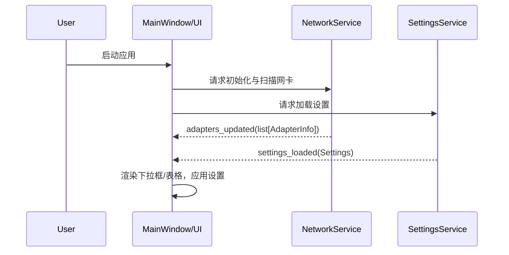
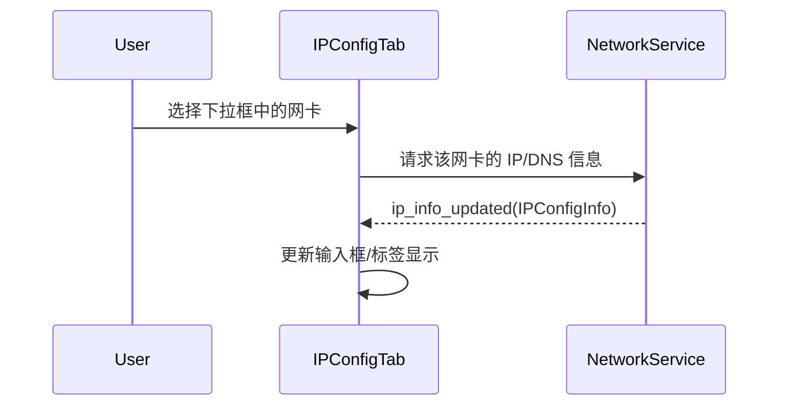
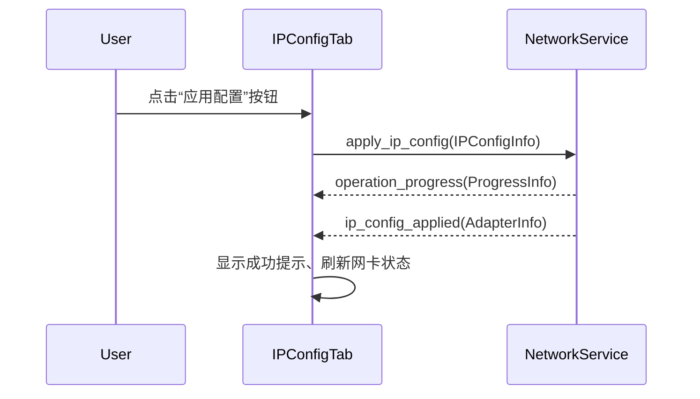
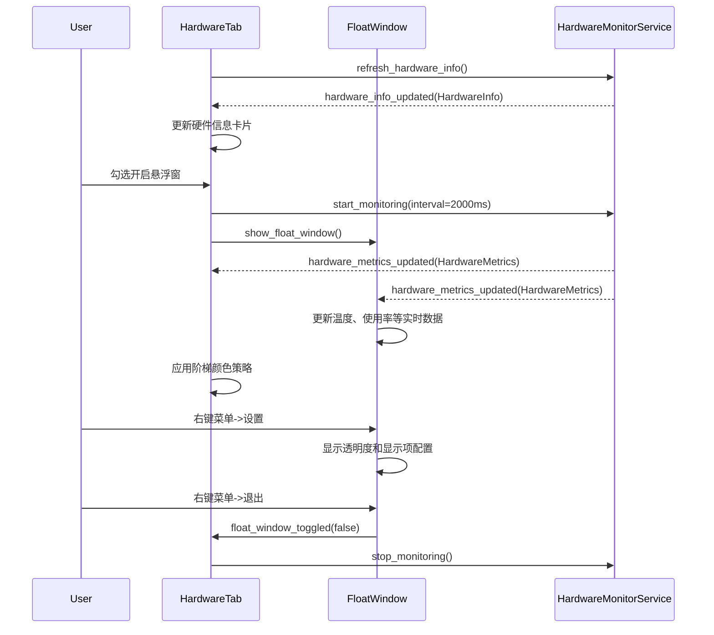
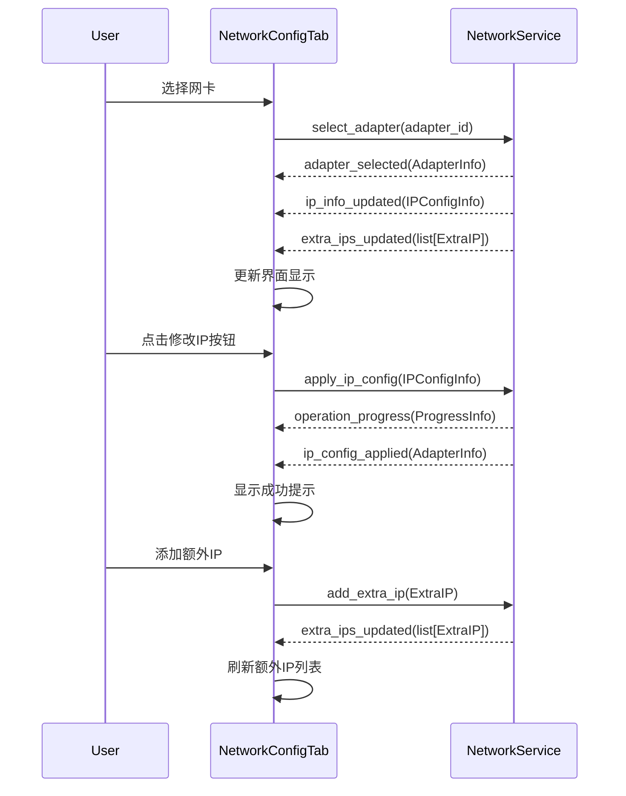
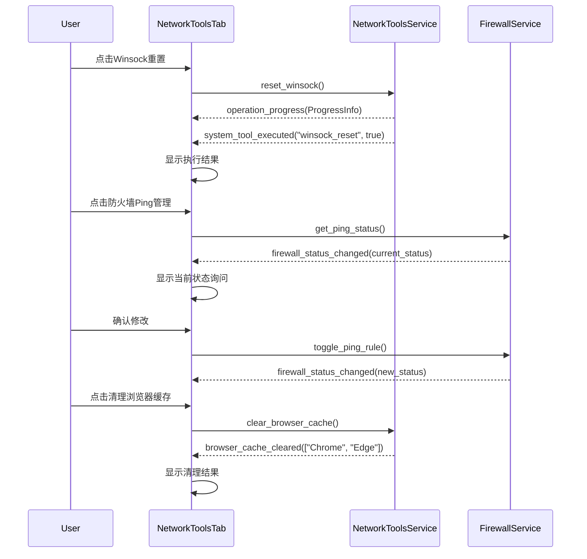
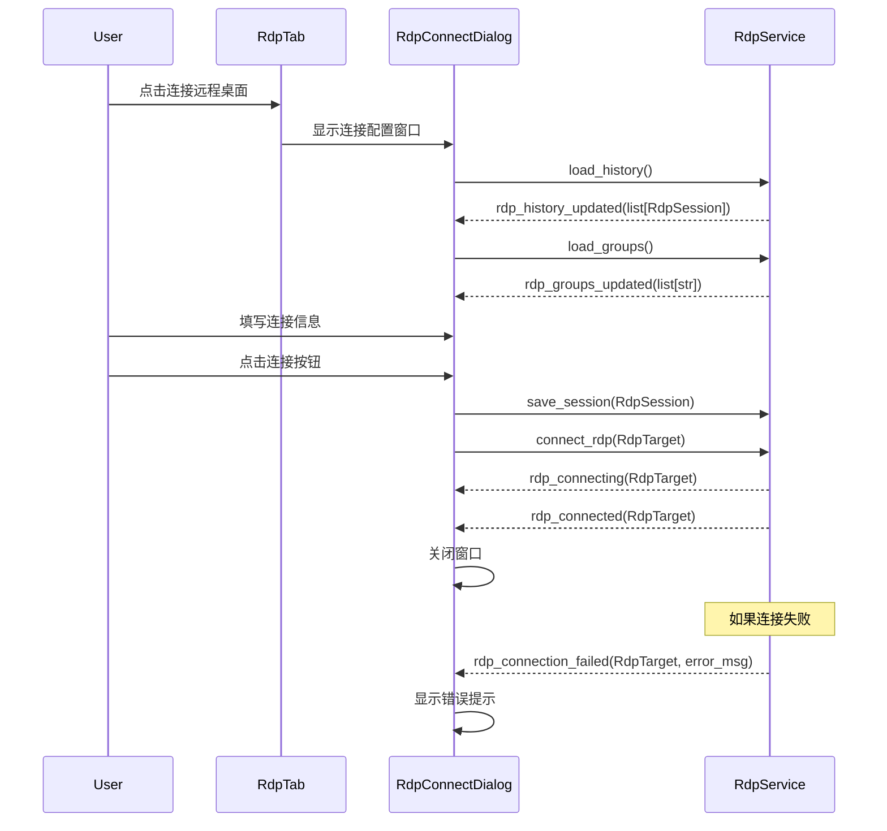

# FlowDesk 数据流与状态管理设计

## 1. 原则
- UI 零业务：仅呈现模型数据与响应用户操作。
- 信号驱动：服务层通过 Signals 将状态变化通知 UI。
- 明确数据模型：所有负载均采用模型层数据类，避免生字典。

## 2. 关键流程序列图

### 2.1 启动应用


### 2.2 选择网卡


### 2.3 应用网络配置


## 3. 核心信号定义表（基于实际功能需求）

### 3.1 网络配置服务信号
- `adapters_updated(list[AdapterInfo])` - 网卡列表更新
- `adapter_selected(AdapterInfo)` - 网卡选择变更
- `ip_info_updated(IPConfigInfo)` - IP配置信息更新
- `adapter_status_changed(str, str)` - 网卡状态变更（adapter_id, status）
- `ip_config_applied(AdapterInfo)` - IP配置应用成功
- `extra_ips_updated(list[ExtraIP])` - 额外IP列表更新
- `network_info_copied(str)` - 网卡信息复制完成

### 3.2 网络工具服务信号
- `ping_started(str)` - Ping测试开始
- `ping_result(PingResult)` - Ping结果更新（含阶梯颜色）
- `ping_completed(PingStats)` - Ping测试完成
- `tracert_started(str)` - 路由追踪开始
- `tracert_hop(TracertHop)` - 路由跳点更新
- `tracert_completed(TracertResult)` - 路由追踪完成
- `system_tool_executed(str, bool, str)` - 系统工具执行结果（工具名、成功状态、消息）
- `firewall_ping_status(bool)` - 防火墙Ping规则状态
- `win11_autologin_status(bool)` - Win11自动登录状态
- `browser_cache_cleared(list[str])` - 浏览器缓存清理完成
- `winsock_reset_completed(bool)` - Winsock重置完成
- `computer_name_changed(str)` - 计算机名修改完成
- `user_created(str)` - 系统用户创建完成
- `rdp_service_enabled(bool)` - RDP服务启用状态

### 3.3 远程桌面服务信号
- `rdp_enabled(bool)` - RDP服务启用状态
- `rdp_connecting(RdpTarget)` - RDP连接开始
- `rdp_connected(RdpTarget)` - RDP连接成功
- `rdp_connection_failed(RdpTarget, str)` - RDP连接失败
- `rdp_history_updated(list[RdpSession])` - RDP历史记录更新
- `rdp_groups_updated(list[str])` - RDP分组列表更新
- `rdp_session_saved(RdpSession)` - RDP会话保存完成
- `rdp_group_created(str)` - 新分组创建完成
- `rdp_group_changed(str, str)` - 会话分组变更完成（会话ID，新分组）
- `rdp_search_results(list[RdpSession])` - 历史记录搜索结果

### 3.4 硬件监控服务信号
- `hardware_info_updated(HardwareInfo)` - 硬件信息更新
- `hardware_metrics_updated(HardwareMetrics)` - 实时监控数据更新（含阶梯颜色）
- `float_window_toggled(bool)` - 悬浮窗显示状态
- `float_window_settings_updated(FloatWindowSettings)` - 悬浮窗配置更新
- `hardware_info_copied(str)` - 硬件信息复制完成（含时间戳）
- `hardware_refresh_completed()` - 硬件信息刷新完成
- `lhm_status_changed(bool)` - LibreHardwareMonitor可用状态

### 3.5 通用系统信号
- `operation_progress(ProgressInfo)` - 操作进度更新
- `error_occurred(ErrorInfo)` - 错误信息通知
- `status_message(str)` - 状态栏消息更新
- `capabilities_updated(Capabilities)` - 系统能力更新

## 4. UI 槽函数注释示范
```python
# 说明：此槽函数专用于响应 NetworkService 的适配器更新信号。
# 角色：将原始数据列表转换为 UI 模型，并更新下拉框选项。
# 原因：这是驱动主界面网络相关显示的核心入口。
def on_adapters_updated(self, adapters: list[AdapterInfo]) -> None:
    self.adapter_combo.clear()
    for adapter in adapters:
        self.adapter_combo.addItem(adapter.friendly_name, adapter)

## 8. 能力矩阵（运行期）
- 结构：`capabilities = { "win7": bool, "hw_monitor": bool, "admin": bool }`
- 用途：UI 初始化时根据能力禁用不支持的功能，并显示解释性提示。

## 9. 硬件监控与悬浮窗数据流


## 10. 资源与图标
- 图标从 `assets/icons/` 加载；通过统一的 `resource_path()` 定位。
- 托盘与窗口图标保持一致；Win7 无法启用高级效果时维持图标清晰度。

## 11. 数据模型定义（基于UI截图功能）

### 11.1 网络相关模型
```python
@dataclass
class AdapterInfo:
    id: str
    name: str
    friendly_name: str
    mac_address: str
    status: str  # "已连接", "已禁用", "未连接"
    ip_addresses: list[str]
    subnet_masks: list[str]
    gateway: str
    dns_servers: list[str]
    dhcp_enabled: bool
    link_speed: str

@dataclass
class IPConfigInfo:
    adapter_id: str
    ip_address: str
    subnet_mask: str
    gateway: str
    dns_primary: str
    dns_secondary: str
    dhcp_enabled: bool

@dataclass
class ExtraIP:
    ip_address: str
    subnet_mask: str
    selected: bool = False

@dataclass
class PingResult:
    target: str
    response_time: float
    status: str  # "成功", "超时", "失败"
    color: str  # 阶梯颜色："green", "orange", "red"
    timestamp: datetime

@dataclass
class TracertHop:
    hop_number: int
    ip_address: str
    hostname: str
    response_times: list[float]
    status: str

@dataclass
class SystemToolResult:
    tool_name: str
    success: bool
    message: str
    details: str = ""
```

### 11.2 远程桌面模型
```python
@dataclass
class RdpSession:
    id: str
    target_ip: str
    port: int = 3389
    username: str = "Administrator"
    password: str = ""
    group: str = "全部"
    remark: str = ""
    connection_count: int = 0
    last_connected: datetime = None

@dataclass
class RdpTarget:
    ip: str
    port: int
    username: str
    password: str
```

### 11.3 硬件监控模型
```python
@dataclass
class HardwareMetrics:
    cpu_temp: float
    cpu_temp_color: str  # 阶梯颜色
    cpu_usage: float
    cpu_usage_color: str
    gpu_temp: float
    gpu_temp_color: str
    disk_temp: float
    disk_temp_color: str
    fan_rpm: int
    memory_usage: float
    memory_usage_color: str
    network_upload: float
    network_download: float
    local_ip: str
    timestamp: datetime

@dataclass
class FloatWindowSettings:
    opacity: float = 0.8
    show_cpu_temp: bool = True
    show_cpu_usage: bool = True
    show_gpu_temp: bool = True
    show_disk_temp: bool = True
    show_ip_address: bool = True
    show_network_speed: bool = True
    position_x: int = -1  # -1表示默认位置
    position_y: int = -1

@dataclass
class HardwareInfo:
    cpu: dict
    gpu: list[dict]
    memory: dict
    storage: list[dict]
    motherboard: dict
    displays: list[dict]
    system: dict
```

## 12. 典型流程：网络配置页面交互


## 13. 典型流程：网络工具页面9宫格按钮


## 14. 典型流程：远程桌面连接管理


## 15. 角色与职责（硬约束）
- UI（View）：仅连接与更新视图；不包含任何业务逻辑、系统命令、数据解析。
- Service：执行业务与系统访问；统一发射模型化信号；处理错误并给出 ErrorInfo.

## 16. 线程与进度
- 长任务（扫描、写入、tracert、LHM 采样）在服务层线程/线程池运行；
- 进度通过 `operation_progress(ProgressStep)` 分段回传到 UI 主线程；
- UI 槽函数只更新视图，不阻塞。

## 17. 验收断言
- UI 层无任何 `subprocess/wmi/winreg` 等调用；
- 所有 `emit` 负载均为模型类实例或只读基本类型；
- 停止/完成事件完整闭环：started → progress → completed/stopped；
- 错误统一走 `error_occurred(ErrorInfo)` 并包含诊断建议。